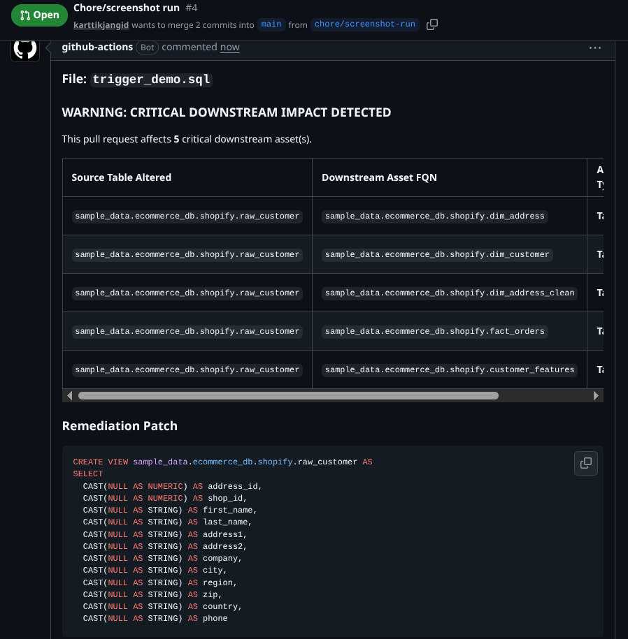
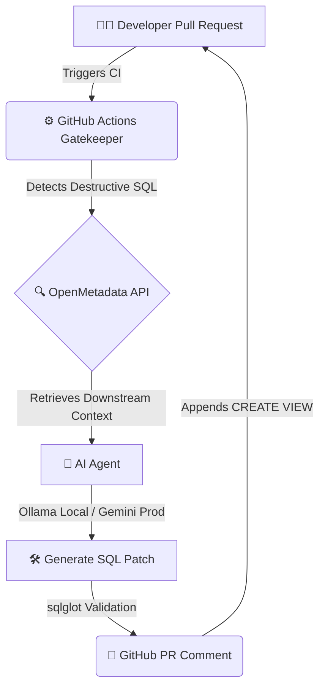

# ⚡ Auto-Medic: Your CI/CD Pipeline's Self-Healing Immune System

> **Governance that doesn't just catch the fire — it builds the sprinkler system.**


> **TL;DR:** Auto-Medic is a CI/CD Gatekeeper that intercepts destructive SQL migrations in Pull Requests, traverses the live data lineage graph to quantify blast radius, and autonomously generates a validated, backward-compatible SQL remediation patch — all before a human even reviews the PR.

---

## 📸 The Magic in Action



---

## 🩺 The "Before & After"

| | 😤 The Old Way | 🚀 The Auto-Medic Way |
|---|---|---|
| **Governance Action** | Block the PR. Full stop. | Block the PR **and write the fix.** |
| **Developer Experience** | "Your PR is blocked. Figure it out." | "Your PR is blocked. Here is your `CREATE VIEW` patch." |
| **Mean Time to Resolution** | Hours of back-and-forth between data engineers and developers | **Zero.** The fix is in the PR comment before the developer refreshes the page. |
| **Blast Radius Awareness** | Unknown. Developers guess at downstream impact. | Quantified. Graph lineage traversal identifies every Tier-1 downstream asset. |
| **Pipeline Downtime** | Breaking schema changes slip through and shatter dashboards & ML models | Expand-Contract pattern enforced. Legacy consumers never see a missing column. |
| **Ops Burden** | Data engineers manually write migration patches | Autonomous AI agent generates, sanitizes, and AST-validates the SQL patch. |

---

## 🔥 The Problem: Governance That Creates Friction

In modern data engineering, schema changes are a minefield. A single `DROP TABLE` or `ALTER TABLE DROP COLUMN` in a PR can cascade into:

- 💥 **Broken BI dashboards** querying a column that no longer exists
- 💥 **Silently failing ML feature pipelines** producing stale or null data
- 💥 **Downstream `dbt` models** throwing `column not found` errors in production

The standard governance answer is a blunt instrument: **block the PR**. This creates a wall between developers and deployment, grinding release velocity to a halt with no path forward offered. Data teams spend hours playing ticket-tennis instead of shipping.

---

## 💡 The Solution: Autonomous, Self-Healing Governance

**Auto-Medic** obliterates this paradigm. Governance becomes an **autonomous enabler**, not a wall.

When a destructive migration threatens Tier-1 assets, Auto-Medic does five things in sequence — all within a single GitHub Actions run:

1. 🔍 **Detects** the destructive SQL statement via **AST parsing** (not fragile regex)
2. 🌐 **Traverses** the live **OpenMetadata lineage graph** to map every impacted downstream asset
3. 📊 **Quantifies** blast radius and classifies risk by asset Tier
4. 🤖 **Generates** a backward-compatible `CREATE VIEW` remediation patch using an **AI agent with strict dialect enforcement**
5. 📝 **Delivers** a full impact report + validated SQL patch **directly into the GitHub PR comment**

> The developer gets a merge block **and** the exact code to unblock themselves. Zero data engineering intervention required.

---

## 🏗️ Architecture Flow



---

## 🛠️ Technical Deep Dive: Enterprise-Grade Under the Hood

This is not a basic API wrapper. Every layer is engineered for correctness and resilience.

### 🔬 AST-Based Mutation Detection — Not Regex

`parser.py` uses **`sqlglot`'s full Abstract Syntax Tree (AST)** to parse every SQL file changed in a PR. It walks the AST node tree to identify mutation-class statements — `DROP`, `ALTER TABLE`, `UPDATE`, `INSERT`, `DELETE` — while **explicitly ignoring read-only `SELECT`/`JOIN` references**. Column drops within `ALTER TABLE` statements are caught at the AST node level, not by string matching. This means it handles dialect variance, multi-statement files, and commented-out SQL without false positives.

### 🌐 Graph Lineage Traversal via OpenMetadata

`api_client.py` doesn't just check if a table exists. It calls OpenMetadata's **downstream lineage graph API** and recursively traverses the dependency graph from the mutated table outward, collecting every downstream asset — Tables, Dashboards, ML Models, Pipelines. Each asset is then queried for its **Tier classification tag** to determine risk severity. An asset tagged `Tier1` constitutes a critical-path dependency and triggers a hard CI block (`exit 100`).

### 🧠 AI Agent with Deterministic Constraints & Graceful Degradation

`remediation_agent.py` and `llm_client.py` implement a production-hardened AI agent loop:

- **Strict negative prompting:** The LLM is instructed that the first character of its response *must* be `C` for `CREATE VIEW`. No preamble, no explanation, no markdown.
- **Programmatic sanitization:** A post-generation regex pass strips any markdown code fences (` ```sql `) the model may have hallucinated, before the output ever touches the validator.
- **AST-level SQL validation:** The sanitized output is parsed by `sqlglot` using the **BigQuery dialect** (`read="bigquery"`, `dialect="bigquery"`). If the output is syntactically invalid SQL, the exception is caught, the error is logged with the full offending SQL string, and the agent exits cleanly (`sys.exit(0)`). **The CI pipeline is never broken by LLM instability.**
- **Hybrid LLM Routing:** The agent routes to **local Ollama** in `ENV_MODE=local` (free, offline development) and automatically escalates to **Google Gemini** or **OpenRouter** in production — with multi-level fallback and detailed telemetry logging at every hop.

### 🛡️ Expand-Contract Migration Pattern Enforcement

The generated remediation patch implements the industry-standard **Expand-Contract pattern**: instead of deleting a column and breaking consumers, Auto-Medic creates a `CREATE VIEW` that exposes the same interface, backfilling dropped columns with `CAST(NULL AS <data_type>) AS <column_name>`. Downstream consumers (dashboards, ML pipelines, dbt models) continue to function without modification.

---

## 📈 Business Impact: Why This Matters at Scale

> Every data team running more than 5 engineers has experienced this exact pain. Auto-Medic eliminates it structurally.

| Impact Area | Without Auto-Medic | With Auto-Medic |
|---|---|---|
| **Mean Time to Recover (MTTR)** | 2–8 hours of senior data engineer time per schema incident | **< 5 minutes** — patch is in the PR comment automatically |
| **Release Velocity** | Schema change PRs stall for days waiting for remediation guidance | Developers self-serve the fix immediately, **PRs merge faster** |
| **Operational Cost** | Data engineers pulled from roadmap work to triage schema breakage | **Zero unplanned interruptions** — the agent handles triage end-to-end |
| **Dashboard Reliability** | BI dashboards silently serve `null` or throw errors post-deploy | **100% backward compatibility guaranteed** by Expand-Contract enforcement |
| **Compliance Posture** | Tier-1 asset changes are undocumented and discovered reactively | **Every destructive change is intercepted, logged, and reported** in the PR |

**The core value proposition is simple:** one prevented production incident pays for this system many times over. The automation of a senior data engineer's 4-hour remediation workflow into a 30-second CI job is a direct input cost reduction.

---

## 🚀 Quick Start / Local Setup

### 1. Environment Setup

Create a `.env` file in the root directory:

```env
ENV_MODE=local
GEMINI_API_KEY=your_gemini_key_here
OPENROUTER_API_KEY=your_openrouter_key_here
OPENMETADATA_HOST=http://localhost:8585/api
OPENMETADATA_JWT_TOKEN=your_jwt_token_here
```

### 2. Install Dependencies

```bash
conda create -n openmetadata python=3.10
conda activate openmetadata
pip install -r requirements.txt
```

### 3. Expose OpenMetadata for GitHub Actions

If you are testing the full CI/CD loop via GitHub Actions, your runner needs to reach your local OpenMetadata instance. Spin up an Ngrok tunnel:

```bash
ngrok http 8585
```

> **Note:** Update the `OPENMETADATA_HOST` GitHub Repository Secret to your new Ngrok URL (e.g., `https://<id>.ngrok-free.app/api`).

### 4. Run the Agent Locally

```bash
python remediation_agent.py
```

---

## 🗺️ Roadmap: What We Build Next

Auto-Medic's MVP proves the core loop. The production-grade platform looks like this:

| Milestone | Feature | Value |
|---|---|---|
| **v1.1** | 🔔 **Slack / PagerDuty Alerts** | Notify the data platform team in real-time when a Tier-1 blast radius event is intercepted, with the full impact report in the Slack message. |
| **v1.2** | 🤖 **Auto-Commit the Patch** | Instead of posting the patch as a PR comment, Auto-Medic opens a **sibling PR** with the validated `CREATE VIEW` already committed and linked to the original blocked PR. |
| **v1.3** | 🌿 **Native dbt Integration** | Parse `dbt` manifest files directly to resolve compiled model dependencies, enabling lineage traversal across the full dbt DAG — not just raw SQL files. |
| **v2.0** | 📊 **Blast Radius Heatmap** | Generate a live visual lineage graph (rendered as SVG in the PR comment) showing every downstream asset colored by risk tier. |
| **v2.1** | 🔁 **Multi-Dialect Support** | Extend `sqlglot` validation to Snowflake, Redshift, and Databricks SQL dialects, making Auto-Medic cloud-agnostic. |
| **v2.2** | 📚 **Incident Playbook Generation** | Use the AI agent to generate a full incident playbook (runbook) alongside the SQL patch — documenting the root cause, blast radius, and rollback procedure. |

> **The long-term vision:** Auto-Medic becomes the autonomous data reliability layer that sits between every developer and production — a self-healing data platform that prevents incidents before they can be reported.
