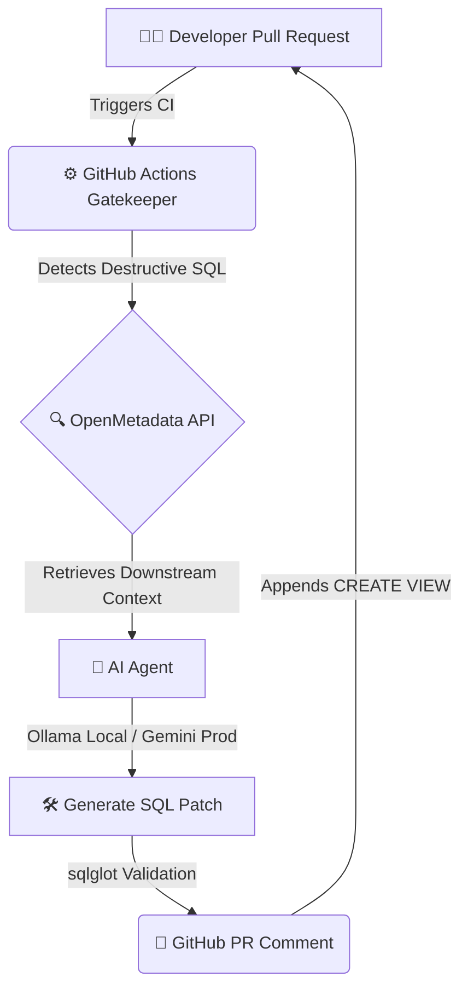

# 🚀 Auto-Medic: Zero-Downtime DataOps

**Turning rigid data governance into an autonomous enabler. Never break downstream pipelines again.**


---

## 📸 The Magic in Action


---

## 🛑 The Problem: Governance Friction
In modern data engineering, "Gatekeepers" are designed to protect production environments by aggressively blocking destructive SQL migrations (like `DROP` or `ALTER TABLE`). While necessary, this creates massive developer friction. Governance acts as a wall, rejecting pull requests without offering a path forward, slowing down release velocity and frustrating engineering teams.

## 💡 The Solution: Autonomous Remediation
**Auto-Medic** pivots this paradigm. Instead of just blocking code, we turn governance into an enabler. When a destructive migration threatens Tier-1 downstream assets (like ML models or executive dashboards), Auto-Medic dynamically catches the failure, assesses the blast radius via OpenMetadata lineage, and deploys an autonomous AI agent to generate a zero-downtime, backward-compatible remediation patch—delivering the fix directly to the developer inside the GitHub PR comment.

---

## 🏗️ Architecture Flow



---

## ⚡ Core Features

* **🔄 "Expand-Contract" Migration Pattern:** Enforces zero-downtime database updates. Instead of dropping columns blindly, Auto-Medic generates automated `CREATE VIEW` abstractions that backfill missing fields with `CAST(NULL AS type)`, ensuring legacy systems never break.
* **🛡️ Deterministic AI Constraints:** AI hallucinations are strictly neutralized. The agent enforces strict negative prompting constraints, mathematically validates the LLM output syntax using the `sqlglot` BigQuery dialect, and gracefully degrades on failure to protect the pipeline.
* **🌐 Hybrid LLM Routing Engine:** Flexible infrastructure scaling. Test freely on your local machine using **Ollama**, and seamlessly scale to production in GitHub Actions using the official **Google GenAI SDK** or **OpenRouter**.

---

## 🚀 Quick Start / Local Setup

Want to run the Auto-Medic locally? Here is how to spin it up.

### 1. Environment Setup
Create a `.env` file in the root directory:
```env
ENV_MODE=local
GEMINI_API_KEY=your_gemini_key_here
OPENROUTER_API_KEY=your_openrouter_key_here
OPENMETADATA_HOST=http://localhost:8585/api
OPENMETADATA_JWT_TOKEN=your_jwt_token_here
```

### 2. Install Dependencies
```bash
conda create -n openmetadata python=3.10
conda activate openmetadata
pip install -r requirements.txt
```

### 3. Expose OpenMetadata for GitHub Actions
If you are testing the full CI/CD loop via GitHub Actions, your runner needs to reach your local OpenMetadata instance. Spin up an Ngrok tunnel:
```bash
ngrok http 8585
```
*Note: Update the `OPENMETADATA_HOST` GitHub Repository Secret to your new Ngrok URL (e.g., `https://<id>.ngrok-free.app/api`).*

### 4. Run the Agent Locally
```bash
python remediation_agent.py
```
